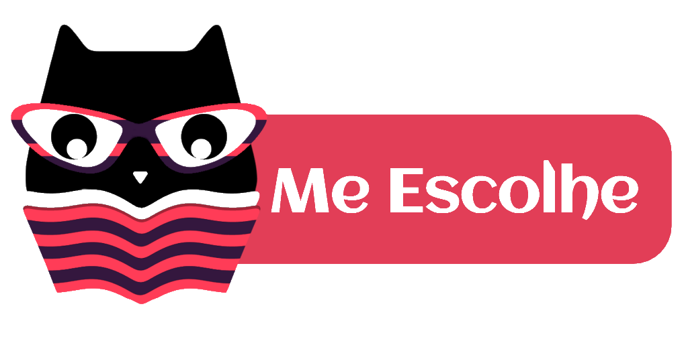

<h3 align="center">
    
    </br>
    <b>CORE: API REST</b>  
    <br>
</h3>

<p align="center">
    
    
    
    
</p>

## Preparando Ambiente

Primeiro de tudo, instalamos as dependências utilizadas pelo Node.js:

```
yarn
```

Em seguida, instalamos o MongoDB. Para tal, temos duas opções:

1. Instalar localmente e definir **27017** como porta de comunicação;
2. Utilizar um contâiner docker com uma imagem **mongodb**:

```
docker pull mongo
docker run --name mongodb -p 27017:27017 -d mongo
```

## Rodando o Servidor

Podemos executar a API REST em dois modos:

1. Em **modo de demonstração**, utilizando o seguinte comando:

```
yarn run start
```

Neste caso, será usado o banco de dados _me-escolhe-demo_

2. Em **modo de desenvolvimento**, utilizando o seguinte comando:

```
yarn run dev
```

Neste caso, será usado o banco de dados _me-escolhe-dev_

3. Em **modo de produção**, utilizando o seguinte comando:

```
yarn run prod
```

Neste caso, será usado o banco de dados _me-escolhe-prod_

Opcionalmente podemos executar a aplicação em modo de produção através de um contâiner **docker** com os comandos:

```
docker build --tag me-escolhe-core .
docker run --name core -p 8080:8080 -d me-escolhe-core
```

## Requisitos

Para executar corretamente, e em ambiente seguro, a API é necessário utilizar as dependências necessárias nas seguintes versões:

1. Node.js na versão **10.x**;
2. MongoDB na versão **4.x**.

> AVISO:
> Caso sejam usadas outras versões, podem haver problemas de compilação e comportamentos indesejados. Isso pode causar transtornos não apenas em ambiente de desenvolvimento, como também em produção. Esteja avisado.

## Contribuindo
Faça um pull request e deixe claro quais alterações foram feitas e quais bugs persistem. Não introduza bugs, seja proativo!

## Licença
* **MIT License** - [*Ver detalhes*](./LICENSE.txt)
